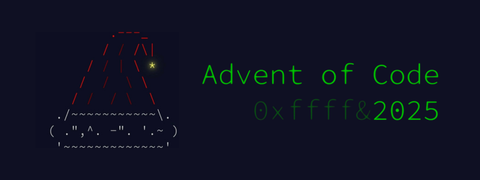

  

 

  
  
  
  

 

## 🚀 My Advent of Code 2025 Journey

I first learned about **Advent of Code** and was immediately drawn to its unique format, which combines engaging puzzles with technical challenges. This year, I decided to dive in! The whole 12-day experience, with its continuous, interwoven story, was an excellent training ground for **logical thinking** and enhancing **problem-solving skills**.

A significant part of the challenge was **handling large input**, parsing the data efficiently, and then coding robust solutions. The puzzles were incredibly interesting, blending various computer science concepts. I found particular difficulty in tackling the complex mathematical systems of **Day 10 (Factory)** and the intricate tiling/backtracking required for **Day 12 (Christmas Tree Farm)**, but overcoming those hurdles was immensely rewarding.

# 📚 Table of Contents

* [Day 1: Secret Entrance](#-day-1-secret-entrance)
* [Day 2: Gift Shop](#-day-2-gift-shop)
* [Day 3: Lobby](#-day-3-lobby)
* [Day 4: Printing Department](#-day-4-printing-department)
* [Day 5: Cafeteria](#-day-5-cafeteria)
* [Day 6: Trash Compactor](#-day-6-trash-compactor)
* [Day 7: Laboratories](#-day-7-laboratories)
* [Day 8: Playground](#-day-8-playground)
* [Day 9: Movie Theater](#-day-9-movie-theater)
* [Day 10: Factory](#-day-10-factory)
* [Day 11: Reactor](#-day-11-reactor)
* [Day 12: Christmas Tree Farm](#-day-12-christmas-tree-farm)

---

## 🎄 Day 1: Secret Entrance

  
🌟 Part 1: Final Position Count (Answer: 1055)

### 📝 Description
You are at the secret entrance to the North Pole base, but the password is locked in a safe. The safe has a dial with numbers $\text{0}$ through $\text{99}$. You are given a sequence of rotations (e.g., $\text{L68}$ or $\text{R48}$). The dial starts at $\text{50}$.

The actual password is the **number of times the dial is left pointing at $\text{0}$ after any rotation** in the sequence. The dial wraps around (e.g., one click left from $\text{0}$ is $\text{99}$).

### 💡 Approach
1.  **Read Input:** Read each rotation (direction and distance) from the input file.
2.  **Maintain Position:** Use an integer variable, `dial`, initialized to $\text{50}$, to track the current position of the dial.
3.  **Apply Rotation:**
    * For a right rotation ($\text{R}$), add the distance to `dial`.
    * For a left rotation ($\text{L}$), subtract the distance from `dial}$.
4.  **Handle Wrap-Around:** Since the dial is $\text{0}$ to $\text{99}$, we must use the modulo arithmetic or a loop to keep the `dial` value within this range:
    * **Right:** If `dial` is $\ge \text{100}$, repeatedly subtract $\text{100}$.
    * **Left:** If `dial}$ is $<\text{0}$, repeatedly add $\text{100}$.
5.  **Count:** After each rotation, check if `dial` is equal to $\text{0}$. If it is, increment a counter.

### 💻 Solution Location (C++)
The C++ code for Part 1 can be found in the repository at:
**[View C++ Code for Part 1](./Day1/Part1.cpp)**
**[View Input](./Day1/input.txt)**

  
🌟 Part 2: Total Clicks Count (Answer: 6386)

### 📝 Description
The new security protocol ("method $\text{0x434C49434B}$") changes the password rule. You must now count the **total number of times any click causes the dial to point at $\text{0}$**, regardless of whether it happens during a rotation or at the end of one. For large rotations, the dial may pass $\text{0}$ multiple times.

### 💡 Approach
1.  **Read Input & Setup:** The setup is the same as Part 1, maintaining the current `dial` position and a counter.
2.  **Simulate Click by Click:** Since we need to count every time $\text{0}$ is reached, we must simulate the rotation one click at a time instead of calculating the final position directly.
3.  **Apply Click Logic:**
    * Use a loop that runs for the `distance` of the rotation.
    * **Right ($\text{R}$):** Increment `dial`. Apply modulo $\text{100}$: `dial = (dial + 1) % 100;`.
    * **Left ($\text{L}$):** Decrement `dial}$. Apply wrap-around (using $\text{+ 100}$ before modulo to handle negative results): `dial = (dial - 1 + 100) % 100;`.
    * **Count:** Inside the loop, after updating the `dial` position for that click, check if `dial}$ is equal to $\text{0}$. If it is, increment the `countZero` counter.

### 💻 Solution Location (C++)
The C++ code for Part 2 can be found in the repository at:
**[View C++ Code for Part 2](./Day1/Part2.cpp)**
**[View Input](./Day1/input.txt)**

## 🎁 Day 2: Gift Shop

  
🌟 Part 1: Double-Repeated IDs (Answer: 29940924880)

### 📝 Description
A young Elf added invalid product IDs to the gift shop database. You are given a single line of comma-separated ID ranges (e.g., $\text{L-R}$). An ID is considered **invalid** if it is made only of a sequence of digits repeated **exactly twice** (e.g., $\text{55}$, $\text{6464}$, $\text{123123}$). IDs do not have leading zeros. Your task is to find the sum of all invalid IDs within the given ranges.

### 💡 Approach
1.  **Parse Input:** Read the single line of input, split it by commas ($\text{,}$) to get individual ranges. Then, split each range by the dash ($\text{-}$) to get the start ($\text{L}$) and end ($\text{R}$) IDs.
2.  **Iterate Ranges:** Loop through every integer ID $x$ from $L$ to $R$.
3.  **Check for Double Repeat (`isDoubleNumber`):**
    * Convert the ID $x$ to a string $s$.
    * An ID can only be a double repeat if its length $n$ is **even**.
    * Check if the first half of the string ($s[0 \dots n/2 - 1]$) is exactly equal to the second half of the string ($s[n/2 \dots n - 1]$).
4.  **Sum Total:** If an ID is invalid, add it to the running `total`. Since the IDs can be very large (up to 11 digits), use a $\text{long long}$ data type for the total sum.

### 💻 Solution Location (C++)
The C++ code for Part 1 can be found in the repository at:
**[View C++ Code for Part 1](./Day2/Part1.cpp)**
**[View Input](./Day2/input.txt)**

  
🌟 Part 2: At Least Twice Repeated IDs (Answer: 48631958998)

### 📝 Description
The rule for invalid IDs has been updated: an ID is now invalid if it is made only of some sequence of digits repeated **at least twice** (e.g., $\text{12341234}$ two times, $\text{123123123}$ three times, $\text{1111111}$ seven times). The task remains to find the sum of all invalid IDs across all ranges.

### 💡 Approach
1.  **Iterate Ranges:** The input parsing and range iteration remains the same as Part 1.
2.  **Check for General Repeat (`isRepeatedPattern`):**
    * Convert the ID $x$ to a string $s$ of length $n$.
    * Iterate through all possible pattern lengths, $k$, from $\text{1}$ up to $n/2$. This $k$ is the length of the potential repeating block.
    * **Check Divisibility:** The total length $n$ must be perfectly divisible by the block length $k$ ($n \pmod k = 0$).
    * **Extract Block:** Take the first $k$ characters as the repeating `block`.
    * **Rebuild and Compare:** Reconstruct the entire string $s$ by repeating the `block` $n/k$ times. If the reconstructed string matches the original string $s$, the ID is invalid, and we can immediately return $\text{true}$.
3.  **Sum Total:** If an ID is invalid, add it to the $\text{long long}$ running `total`.

### 💻 Solution Location (C++)
The C++ code for Part 2 can be found in the repository at:
**[View C++ Code for Part 2](./Day2/Part2.cpp)**
**[View Input](./Day2/input.txt)**

## ⚡ Day 3: Lobby

  
🌟 Part 1: Max 2-Digit Joltage (Answer: 17229)

### 📝 Description
You must turn on **exactly two** batteries from each bank. The joltage output is the 2-digit number formed by the digits of the two chosen batteries (in the order they appear). Find the **largest possible 2-digit joltage** from each bank and sum these maximum values.

### 💡 Approach
This is solved using a **Greedy Algorithm** with a Monotonic Stack to find the largest number that can be formed by keeping $K=2$ digits and removing the rest, while maintaining relative order. 

1.  **Goal:** Keep $K=2$ digits (and remove $M = N - K$ digits).
2.  **Greedy Removal:** Iterate through the digits. Maintain a stack. If the last digit in the stack is smaller than the current digit, pop the last digit (greedy choice to improve the prefix) as long as the removal budget ($M$) allows.
3.  **Final Truncation:** Truncate the stack to exactly $K=2$ digits.
4.  **Calculate Total:** Convert the resulting 2-digit number and sum it up using a $\text{long long}$.

### 💻 Solution Location (C++)
The C++ code for Part 1, using the `pickBest(s, 2)` function, can be found in the repository at:
**[View C++ Code for Part 1](./Day3/Part1.cpp)**
**[View Input](./Day3/input.txt)**

  
🌟 Part 2: Max 12-Digit Joltage (Answer: 170520923035051)

### 📝 Description
The new requirement is to turn on **exactly twelve** batteries ($\text{K}=12$) within each bank. Find the total output joltage.

### 💡 Approach
The approach is identical to Part 1, but the target length $K$ is changed from 2 to 12. The `pickBest` function, which is implemented using the Monotonic Stack, is called with $K=12$: `pickBest(s, 12)`.

### 💻 Solution Location (C++)
The C++ code for Part 2, using the `pickBest(s, 12)` function, can be found in the repository at:
**[View C++ Code for Part 2](./Day3/Part2.cpp)**
**[View Input](./Day3/input.txt)**

## 📦 Day 4: Printing Department

  
🌟 Part 1: Initial Accessible Rolls (Answer: 1604)

### 📝 Description
A roll of paper ('@') is **accessible** if it has **fewer than four** other rolls of paper in its eight adjacent positions (including diagonals). Find the total count of accessible rolls in the initial configuration.

### 💡 Approach
This is a straightforward grid traversal and neighbor-counting problem.

1.  **Read Grid:** Read the grid into a `vector<string>`.
2.  **Traverse and Count:** Iterate over every '@'. Check all eight surrounding cells (ensuring boundaries). 
3.  **Accessibility:** If the count of '@' neighbors is less than $\text{4}$, increment the `total` count.

### 💻 Solution Location (C++)
The C++ code for Part 1 can be found in the repository at:
**[View C++ Code for Part 1](./Day4/Part1.cpp)**
**[View Input](./Day4/input.txt)**

  
🌟 Part 2: Total Removable Rolls (Answer: 9397)

### 📝 Description
Once an accessible roll is removed (changed to '.'), the removal may make neighbors newly accessible. Repeat the process until no more rolls can be accessed. Find the **total number of rolls removed**. 

### 💡 Approach
This requires a simulation loop that continues until a stable state is reached.

1.  **Simulation Loop:** Loop until no rolls are removed in an iteration.
2.  **Identify Removals:** In each step, iterate over the entire grid and collect the coordinates (`toRemove`) of all accessible rolls based on the *current* state.
3.  **Execute Removals:** If `toRemove` is not empty, simultaneously remove all collected rolls (set them to '.').
4.  **Update Total:** Add the number of removals to `totalRemoved`.

### 💻 Solution Location (C++)
The C++ code for Part 2 can be found in the repository at:
**[View C++ Code for Part 2](./Day4/Part2.cpp)**
**[View Input](./Day4/input.txt)**

## ☕ Day 5: Cafeteria

  
🌟 Part 1: Count Fresh Available IDs (Answer: 525)

### 📝 Description
An ingredient is **fresh** if its ID falls within *any* of the given overlapping fresh ID ranges. Given a list of available ingredient IDs, find how many of them are fresh.

### 💡 Approach
The problem is solved by **merging overlapping ranges** first to allow for efficient lookup.

1.  **Merge Overlapping Ranges (Preprocessing):** 
    * Sort the fresh ID ranges by start value.
    * Iterate through the sorted ranges, merging any adjacent or overlapping ranges into a minimal set of non-overlapping ranges. 
2.  **Check Available IDs:** Iterate through the available IDs and check each one against the much smaller list of merged non-overlapping ranges.

### 💻 Solution Location (C++)
The C++ code for Part 1, which implements the range merging logic, can be found in the repository at:
**[View C++ Code for Part 1](./Day5/Part1.cpp)**
**[View Input](./Day5/input.txt)**

  
🌟 Part 2: Total Fresh IDs in Ranges (Answer: 333892124923577)

### 📝 Description
Find the **total count of all unique ingredient IDs** considered fresh by the original fresh ID ranges.

### 💡 Approach
The approach is to use the **Range Merging** logic from Part 1, and then sum the lengths of the resulting non-overlapping ranges.

1.  **Parse & Merge:** Obtain the minimal list of non-overlapping fresh ID ranges.
2.  **Sum Lengths:** Sum the length of every merged range, calculated as $R - L + 1$. The sum is stored in a $\text{long long}$.

### 💻 Solution Location (C++)
The C++ code for Part 2, focusing solely on the range merging and summation, can be found in the repository at:
**[View C++ Code for Part 2](./Day5/Part2.cpp)**
**[View Input](./Day5/input.txt)**

## 🐙 Day 6: Trash Compactor

  
🌟 Part 1: Standard Vertical Math (Answer: 4951502530386)

### 📝 Description
The input is a grid of numbers in vertical columns, with an operator ($\text{+}$ or $\text{*}$) at the bottom of each column. Each column is a math problem. Find the **grand total** of summing the results of all individual problems.

### 💡 Approach
1.  **Read and Tokenize:** Read the input as tokens in a grid structure.
2.  **Calculate Problem Results:** Iterate through each column $i$. Identify the operator. Sum the numbers for $\text{+}$ or multiply them for $\text{*}$.
3.  **Grand Total:** Sum the results of all individual problems using $\text{long long}$.

### 💻 Solution Location (C++)
The C++ code for Part 1 can be found in the repository at:
**[View C++ Code for Part 1](./Day6/Part1.cpp)**
**[View Input](./Day6/input.txt)**

  
🌟 Part 2: Right-to-Left Columnar Numbers (Answer: 8486156119946)

### 📝 Description
The numbers are actually written **right-to-left in columns**, with the most significant digit at the top. You must re-parse the numbers and recalculate the grand total.

### 💡 Approach
The key challenge is correctly reconstructing the numbers, as a single number spans multiple rows but only a single column width, and its digits appear vertically.

1.  **Grid Reconstruction:** Pad the input lines to a uniform width to ensure columnar alignment.
2.  **Number Reconstruction:** For each column representing a number, build a string by reading the digits vertically from top to bottom (excluding the operator row). Convert the string to $\text{long long}$.
3.  **Calculate and Sum:** Apply the operator to the list of reconstructed numbers and add the result to the $\text{long long}$ `grandTotal`.

### 💻 Solution Location (C++)
The C++ code for Part 2, which involves complex parsing to reconstruct the numbers, can be found in the repository at:
**[View C++ Code for Part 2](./Day6/Part2.cpp)**
**[View Input](./Day6/input.txt)**

## 🔬 Day 7: Laboratories

  
🌟 Part 1: Count Beam Splits (Answer: 1546)

### 📝 Description
A tachyon beam travels downward through empty space ('.'). When it hits a splitter ('^'), two new beams are emitted (left and right). Find the total number of times the beam is split.

### 💡 Approach
Solved by simulating the path of the tachyon beams using **Depth First Search (DFS)**, ensuring each splitter is counted only once.

1.  **DFS Simulation:** Start DFS below the starting point $\text{S}$.
2.  **Visited Tracking:** Use a $\text{set}$ to track visited cells to prevent infinite loops and redundant work.
3.  **Splitter Logic:** When a splitter is hit, increment the `splitCount` and initiate two new DFS calls for the split paths. 

### 💻 Solution Location (C++)
The C++ code for Part 1 can be found in the repository at:
**[View C++ Code for Part 1](./Day7/Part1.cpp)**
**[View Input](./Day7/input.txt)**

  
🌟 Part 2: Count Timelines (Answer: 13883459503480)

### 📝 Description
A single particle takes **both** the left and right path at every splitter. The total number of timelines active is the total number of unique paths from $\text{S}$ to the exit boundary.

### 💡 Approach
This is a path-counting problem in a DAG, solved using **Dynamic Programming (or Memoization)**.

1.  **Memoization Setup:** Use a map (`memo`) to store the result for each cell $(r, c)$: the number of timelines that can reach the exit from this cell.
2.  **Recursive Function:** The number of timelines from a cell is the sum of timelines from all possible next steps. If a splitter is hit, the result is $\text{countTimelines}(\text{left}) + \text{countTimelines}(\text{right})$.

### 💻 Solution Location (C++)
The C++ code for Part 2, using memoization to efficiently calculate the paths, can be found in the repository at:
**[View C++ Code for Part 2](./Day7/Part2.cpp)**
**[View Input](./Day7/input.txt)**

## 🔌 Day 8: Playground

  
🌟 Part 1: Multiply Top 3 Circuit Sizes (Answer: 68112)

### 📝 Description
Find the sizes of all resulting circuits after $\text{1000}$ shortest connections between 3D junction box coordinates, and multiply the three largest sizes.

### 💡 Approach
This is solved using the **Disjoint Set Union (DSU)** data structure. Edges are generated, sorted by distance, and the first $\text{1000}$ are processed to form circuits while tracking component sizes. 

1.  **Preparation:** Generate and sort all edges by $\text{distance}^2$.
2.  **DSU Process:** Use DSU to connect the first 1000 edges.
3.  **Result:** Gather all set sizes, sort descending, and multiply the top three.

### 💻 Solution Location (C++)
The C++ code for Part 1, utilizing the DSU structure, can be found in the repository at:
**[View C++ Code for Part 1](./Day8/Part1.cpp)**
**[View Input](./Day8/input.txt)**

  
🌟 Part 2: Last Connection for Full Circuit (Answer: 44543856)

### 📝 Description
Identify the very last connection that merges all junction boxes into **one single circuit**. The answer is the product of the $\text{X}$ coordinates of the two boxes in that final connection.

### 💡 Approach
This is an application of **Kruskal's algorithm** for Minimum Spanning Tree (MST).

1.  **Kruskal's Simulation:** Iterate through the sorted edges, connecting them using DSU $\text{unite}(u, v)$.
2.  **Termination:** The process stops the moment the total number of circuits drops to $\text{1}$.

### 💻 Solution Location (C++)
The C++ code for Part 2, which implements a version of Kruskal's algorithm to track the components count, can be found in the repository at:
**[View C++ Code for Part 2](./Day8/Part2.cpp)**
**[View Input](./Day8/input.txt)**

## 🎬 Day 9: Movie Theater

  
🌟 Part 1: Largest Area, Red Corners Only (Answer: 4759531084)

### 📝 Description
Given red tile coordinates, find the largest rectangle that can be formed using any two red tiles as opposite corners.

### 💡 Approach
A simple **brute-force** check of the area for every pair of red tiles is sufficient.

1.  **Iterate Pairs:** Loop over all unique pairs of red tiles.
2.  **Calculate Area:** $\text{Area} = (|\text{x}_j - \text{x}_i| + 1) \times (|\text{y}_j - \text{y}_i| + 1)$.
3.  **Find Maximum:** Track the maximum area found.

### 💻 Solution Location (C++)
The C++ code for Part 1 can be found in the repository at:
**[View C++ Code for Part 1](./Day9/Part1.cpp)**
**[View Input](./Day9/input.txt)**

  
🌟 Part 2: Largest Area, Red/Green Tiles Only (Answer: 1539238860)

### 📝 Description
The chosen rectangle must have red opposite corners, and **all tiles inside** must be either red or green. Green tiles form the boundary and interior of a closed loop defined by the red tiles.

### 💡 Approach
This requires **Coordinate Compression** to handle sparse grid, and **Computational Geometry** for validity checks.

1.  **Coordinate Compression:** Reduce the coordinates to a smaller, dense grid.
2.  **Brute-Force with Validity Check:** Iterate over all pairs of red tiles as corners.
    * **Validity Check:** Ensure the entire rectangle lies within the defined red/green loop.
    * **Area Calculation (2D Prefix Sum):** If valid, use a pre-calculated 2D prefix sum over the compressed grid to find the true total area. 

### 💻 Solution Location (C++)
The C++ code for Part 2, implementing coordinate compression and the validity checks, can be found in the repository at:
**[View C++ Code for Part 2](./Day9/Part2.cpp)**
**[View Input](./Day9/input.txt)**

## ⚡ Day 10: Factory

  
🌟 Part 1: Minimum Presses for Lights (Answer: 457)

### 📝 Description
Find the fewest total button presses required to match a target light configuration, where buttons toggle light states.

### 💡 Approach
Solved as a system of linear equations over the field $GF(2)$ ($\pmod 2$ arithmetic).

1.  **Gaussian Elimination $\pmod 2$:** Reduce the system of equations.
2.  **Exhaustive Search:** Search all assignments for the free variables to find the solution vector $\vec{x}$ with the minimum number of '1's (presses).

### 💻 Solution Location (C++)
The C++ code for Part 1 can be found in the repository at:
**[View C++ Code for Part 1](./Day10/Part1.cpp)**
**[View Input](./Day10/input.txt)**

  
🌟 Part 2: Minimum Presses for Joltage (Answer: 17576)

### 📝 Description
Find the fewest total button presses ($\vec{x} \ge 0, \vec{x} \in \mathbb{N}_0^M$) to reach positive integer joltage targets, where buttons *add* to counters.

### 💡 Approach
This is an **Integer Linear Programming (ILP)** problem, solved using the **Z3 optimization library** (in Python) to find the optimal integer solution that minimizes the sum of button presses.

### 💻 Solution Location (Python/Z3)
The Python code for Part 2, utilizing the Z3 solver, can be found in the repository at:
**[View Python Code for Part 2](./Day10/Part2.py)**
**[View Input](./Day10/input.txt)**

## ⚛️ Day 11: Reactor

  
🌟 Part 1: Count Simple Paths (Answer: 636)

### 📝 Description
Count the total number of distinct paths from the starting device (`you`) to the end device (`out`) in a directed graph.

### 💡 Approach
Solved using recursive **Depth First Search (DFS)** with cycle detection to ensure only simple paths (no repeated nodes) are counted.

### 💻 Solution Location (C++)
**[View C++ Code for Part 1](./Day11/Part1.cpp)**
**[View Input](./Day11/input.txt)**

  
🌟 Part 2: Count Paths Visiting Two Required Nodes (Answer: 509312913844956)

### 📝 Description
Count the total number of paths from `svr` to `out` that must visit both nodes `dac` and `fft` (in any order).

### 💡 Approach
This requires **Dynamic Programming/Memoization** due to the large number of non-simple paths. The state tracks the current node and whether the two required nodes have been visited: $(\text{node}, \text{dacVisited}, \text{fftVisited})$.

### 💻 Solution Location (C++)
**[View C++ Code for Part 2](./Day11/Part2.cpp)**
**[View Input](./Day11/input.txt)**

## 🎄 Day 12: Christmas Tree Farm

  
🌟 Part 1: Fit Presents in Regions (Answer: 497)

### 📝 Description
Determine how many rectangular regions can fit a specified list of presents, which can be rotated and flipped. Presents must not overlap.

### 💡 Approach
This is a **Tiling Problem** solved with **Backtracking Search**.

1.  **Shape Pre-processing:** Generate all unique rotations and flips for each base shape.
2.  **Outer Variant Search:** Recursively try all combinations of unique variants for the required present instances.
3.  **Inner Backtracking ($\text{solve}$):** Recursively placing the selected set of present variants onto the grid. 

### 💻 Solution Location (C++)
**[View C++ Code for Part 1](./Day12/Part1.cpp)**
**[View Input](./Day12/input.txt)**

  
🌟 Part 2: Completion

  
### 📝 Description
The narrative for Part Two confirmed the completion of the Christmas tree decorating task, and the Elves' immediate need was solved by the analysis in Part One.

### 💡 Approach
No new computational problem was presented for Part Two. Both required stars were collected through the completion of Part 1.

##

  
  <h3 align="left">Maintained By - Priyam Aggarwal (https://github.com/priyamaggarwal18)</h3>
    &nbsp&nbsp;
  &nbsp&nbsp;

